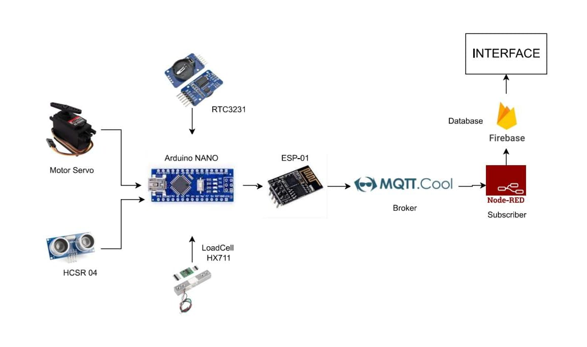

# 🐱 **CatPour** 🐱

## 📌 **TUJUAN**

Banyak pemilik kucing kesulitan memberi makan secara teratur karena kesibukan atau sering bepergian. Ketidakteraturan ini bisa berdampak pada kesehatan kucing. Untuk mengatasi hal tersebut,Sistem ini dirancang untuk mempermudah pemilik kucing dalam memberi makan hewan peliharaan mereka, meningkatkan efisiensi waktu, serta memastikan kucing mendapat porsi makanan yang sesuai kebutuhannya. Dengan bantuan CatPour pemilik tidak perlu khawatir untuk memberi makan kucing peliharaanya apabila tidak berada didalam rumah.
pemilik kucing dapat:
- Memantau status pemberian makan secara real-time.
- Melakukan pengaturan jadwal jarak jauh.
### Support BY :
>- Dosen Pengampu : Akhmad Hendriawan ST., MT. (NIP.197501272002121003) 
>- Mata kuliah : Workshop Mikrokontroller 
>- Program Studi : D3 Teknik Elektronika 
>- Politeknik Elektronika Negeri Surabaya 
## Team Member
|      NRP      |        Nama       |        Jobdesk        |                    Akun                  |
| :-----------: |:----------------: | :-------------------: | :---------------------------------------:|
| 2123500004    | Rachmat Dhani G   | 3D Design             | [Dhani](https://github.com/rachmatdhani)
| 2123500005    | M. Ghibran K      | Hardware              | [Ghibran](https://github.com/Smolyyymokka)
| 2123500020    | Adhitya Ramadhani | UI / UX Design        | [Firman](https://github.com/adhitya161004)
| 2123500025    | Adhi Pramana R    | Programmer            | [Rama](https://github.com/Adhi-Rama)
| 2123500030    | Galang Habibbullah| Project Manager       | [Galang](https://github.com/GalangHabibbullah)
## KOMPONEN 
Proyek ini mengembangkan sistem pemberian makan kucing otomatis berbasis IoT menggunakan komponen utama seperti **Arduino Uno**, **RTC (Real-Time Clock)**, **Loadcell**, dan **sensor HC-SR04**. 
| Komponen        | Fungsi                                                                                   |
|-----------------|------------------------------------------------------------------------------------------|
| **Arduino Uno** | Berfungsi sebagai mikrokontroler utama yang mengontrol sistem, komunikasi sensor, dan pengaturan pemberian makan otomatis. |
| **RTC**         | Menjaga sinkronisasi waktu untuk pemberian makan sesuai jadwal yang telah diatur.         |
| **Loadcell**    | Mengukur berat makanan di wadah makan untuk memastikan porsi makanan yang tepat.          |
| **Sensor HC-SR04** | Untuk memonitoring jumlah kesediaan ppakan dipenampungan pakan.    |
## Desain 3D PCB

## 📊Diagram Blok
Diagram Blok Sistem.

