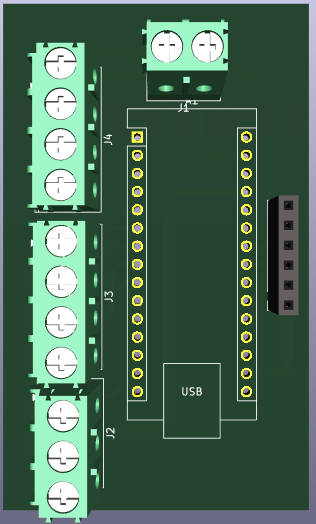
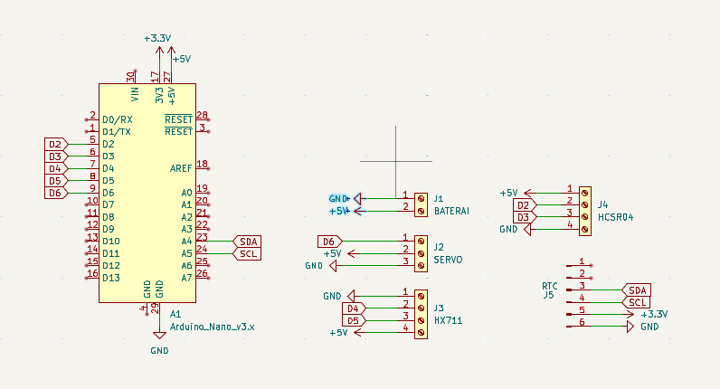
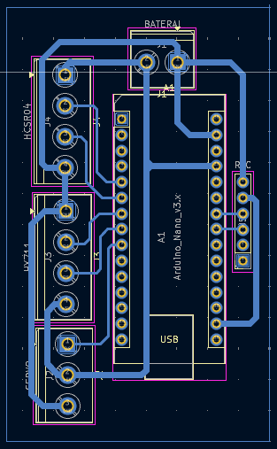
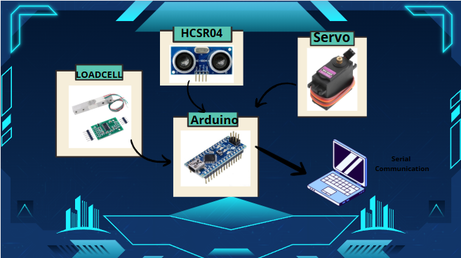

# 🐱 **CatPour** 🐱

---
🐱CatPour🐱 - SOLUSI CERDAS PARA CATLOVERS
Pernah merasa bersalah karena lupa memberi makan kucing karena sedang bepergian jauh? Atau bingung berapa porsi makan kucing yang dibutuhkan? CatPour hadir sebagai solusi cerdas para catlovers

Bayangkan kamu pulang ke rumah setelah berlibur. Kucingmu mengeong karena sedang kelaparan karena makanan yang telah kamu siapkan sudah habis tak bersisa. Tapi tenang kejadian itu tidak akan terulang ketika CatPour hadir.

CatPour hadir untuk menyelesaikan masalah para catlovers ketika sedeang bepergian. Sekarang Catlovers tidak perlu khawatir terhadap kucing piaraanya yang kelaparan, karena Catpour memberikan makanan secara otomatis sesuai jadwal dan dalam porsi yang cukup.

---
## 🎯 Objectives

- Mendeteksi jumlah sisa makanan pada bak penampungan makan  
- Memberi makan sesuai dengan porsi si kucing
- Memberi makan secara otomatis sesuai dengan jadwal makan.
- Menyediakan monitoring sisa makanan secara real-time melalui UART ke komputer
---
## 🧠 LATAR BELAKANG
Mempunyai kucing piaraan merupakan kesenangan sebagian orang, sering kali juga menjadi tantangan dalam hal pemberian makan, terutama bagi orang-orang sibuk atau yang sering  bepergian. Salah satu penyebab ketidakaturan ini bisa berdampak pada kesehatan kucing

**CatPour** memberikan solusi dengan cara pemberian makan otomatis sesuai porsi makan kucing  yang dibutuhkan.

---

## 🦾 Support BY :
>- Dosen Pengampu : Akhmad Hendriawan ST., MT. (NIP.197501272002121003) 
>- Mata kuliah : Workshop Mikrokontroller 
>- Program Studi : D3 Teknik Elektronika 
>- Politeknik Elektronika Negeri Surabaya 
---
## 😎 Team Member
|      NRP      |        Nama       |        Jobdesk        |                    Akun                  |
| :-----------: |:----------------: | :-------------------: | :---------------------------------------:|
| 2123500004    | Rachmat Dhani G   | 3D Design             | [Dhani](https://github.com/rachmatdhani)
| 2123500005    | M. Ghibran K      | Hardware              | [Ghibran](https://github.com/Smolyyymokka)
| 2123500020    | Adhitya Ramadhani | UI / UX Design        | [Firman](https://github.com/adhitya161004)
| 2123500025    | Adhi Pramana R    | Programmer            | [Rama](https://github.com/Adhi-Rama)
| 2123500030    | Galang Habibbullah| Project Manager       | [Galang](https://github.com/GalangHabibbullah)
---
## 🔗 KOMPONEN 🔗 

Proyek ini mengembangkan sistem pemberian makan kucing otomatis berbasis IoT menggunakan komponen utama seperti **Arduino Uno**, **RTC (Real-Time Clock)**, **Loadcell**, dan **sensor HC-SR04**. 
| Komponen        | Fungsi                                                                                   |
|-----------------|------------------------------------------------------------------------------------------|
| **Arduino Uno** | Berfungsi sebagai mikrokontroler utama yang mengontrol sistem, komunikasi sensor, dan pengaturan pemberian makan otomatis. |
| **RTC**         | Menjaga sinkronisasi waktu untuk pemberian makan sesuai jadwal yang telah diatur.         |
| **Loadcell**    | Mengukur berat makanan di wadah makan untuk memastikan porsi makanan yang tepat.          |
| **Sensor HC-SR04** | Untuk memonitoring jumlah kesediaan ppakan dipenampungan pakan.    |
---
## Desain 3D PCB
Desain 3D VIEW KICAD

---

## Desain Schematic PCB
Desain Schematic 

---
## Desain Layout
Desain Layout PCB 

---
## Desain 3D Alat

---
## 📊Diagram Blok
Diagram Blok Sistem.

---
## Software Tools

- [Arduino IDE](https://www.arduino.cc/en/software)
- [KiCad](https://kicad.org/)
- [Figma](https://www.figma.com/)
- [Visual Studio Code](https://code.visualstudio.com/)
---
## PRINSIP KERJA 
## Pembacaan penampungan makan
- Sensor HCSR 04 mengirim nilai jarak yang dikonversi menjadi nilai %
100 % = Penampungan Makan Full ; 0 % = Penampungan Makan Kosong
- Sensor Loadcell membaca berat pakan kucing yang keluar, apabila mencapai 20 gram maka servo akan menutup
## Pemrosesan oleh Arduino 
- Arduino  Membaca data  sensor secara berkala, Keputusan diambil untuk membuka servo atau menutup servo
## Tampilan Gui 
- GUI akan menampilkan data berat, sisa makan dan juga posisi servo

--- 
## Pengembangan Kedepannya
- Penambahan Kamera untuk pemantauan jarak jauh
- Penambahan Pemberi minum secara otomatis

## Link simulasi Wokwi
-- https://wokwi.com/projects/432622796153693185
-- https://github.com/GalangHabibbullah/CatPour_Pemberi_makan_Kucing/tree/fe5401d0f07f7c271f16389e5ba98aa213cf10a5/PROGRAM/Wokwi

## Link video simulasi
-- https://github.com/GalangHabibbullah/CatPour_Pemberi_makan_Kucing/tree/d1d1669227759c1687d57a3f496b5af06effbe53/PROGRAM/Demo
